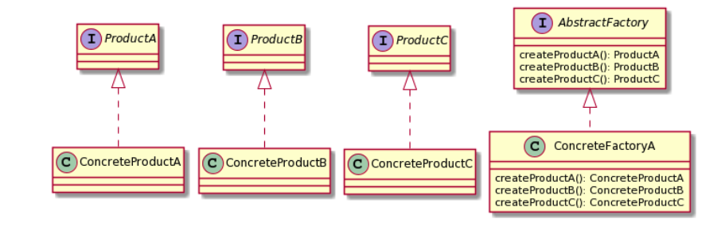

# What is Abstract Factory pattern?

- A creational design pattern that lets you create an abstract representation of factories without specifying concrete classes.
- Think of this pattern as a factory of factories
- The fundamental reason to use this pattern is if you absolutely want to have a runtime client that can interchange different factory objects at runtime, thus producing a different representation or hierarchies

&nbsp;

### UML

&bnsp;

# Classic Implementation
