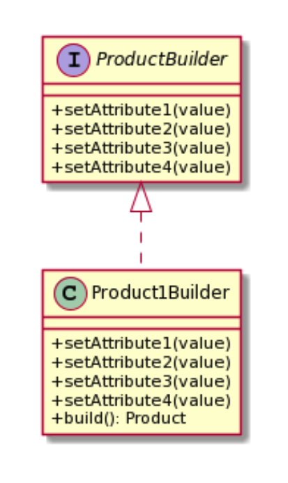

# What is Builder design pattern?

- It allow you to have na interface with common steps to create complex objects that is not tied to any implementation.
- Those steps should be independent, and should always return a usble object when requested
- All parameters must be provided or must have default value

  &nbsp;

### UML



# Classic implementation

```javascript
  class Website {
    constructor(public name?: string, public host?: string, public port?: number, public isPremium?: boolean){}
  }


  interface WebsiteBuilder {
    setName(name: string): WebsiteBuilder
    setHost(host: string): WebsiteBuilder
    setPort(port: number): WebsieBuilder
    setIsPremium(isPremium: boolean): WebsiteBuilder
    build(): Website
  }


  class PremiumWebsiteBuilder implements WebsiteBuilder {
    constructor(private website: Website){
      this.clear()
    }

    setName(name: string): WebsiteBuilder {
      this.website.name = name
      return this
    }

    build(): Website{
      const website = this.website
      this.clear()
      return website
    }

    clear(): void{
      this.website = new Website()
      this.website.isPremium = true
    }
    ...
  }

```

&nbsp;

# Modern Implementation

```javascript
  export type Builder<T> =
  {
    [k in keyof T]? : (arg: T[k]) => Builder<T>
  }
  &
  {
    build(): T
  }

  export function ModelBuilder<T>(): Builder<T> {
    const built: Record<string, unknown> = {}
    const builder = new Proxy (
      {},
      {
        get(target, prop){
          if("build" === prop) {
            return () => build
          }

          return (x: unknown): unknown => {
            built[prop.toString()] = x
            return builder
          }
        }
      }
    )
    return builder as Builder<T>
  }

  interface User {
    id: number
    name: string
    email: string
  }

  const user = ModelBuilder<User>()
    .id(1)
    .name("Theo")
    .email("theo@example.com")
    .build()

```
