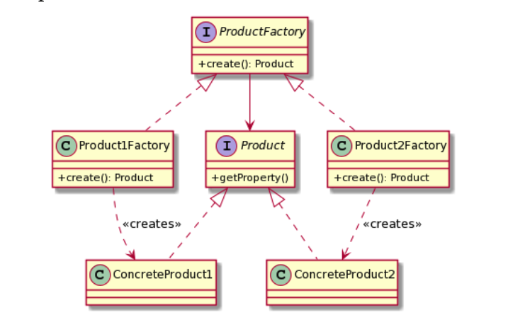

# What is Factory method pattern?

- It deals with the creation of objects and particiularly with delegating the creation of objects using sub-classes.
- With this pattern, you want to try to avoid creating them using the new operator and instead you define a factory for each one of the class

  &nbsp;

### UML

