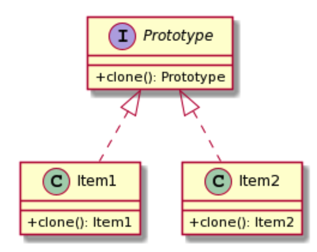

# What is Prototype design pattern?
- It is a kind of object that takes its intial state and properties out of exisitng objects.
- The main idea is to avoid having to manually create an object and assing properties to it from another object.

### UML




# Classic implementation

```javascript
	
	interface HeroPrototype {
		clone(): HeroPrototype
	}
	
```

```javascript
	
	class Wizard implements HeroPrototype {
		private spells: string[]
		private health: number

		constructor(private name: string){
			this.spells = []
			this.health = 100
		}

	}
	
```