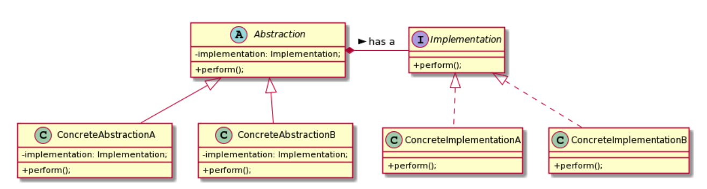

# What is Bridge pattern?

- It acts as connecting point between an abstractin and its implementation.
- One analogy of this pattern is having a universal remote control that works with any TV, even with TVs that are yet to arrive on the market

&nbsp;

### UML

- The arrow that connects the Abstraction class with the Implementation interfaces is what we call the Bridge
