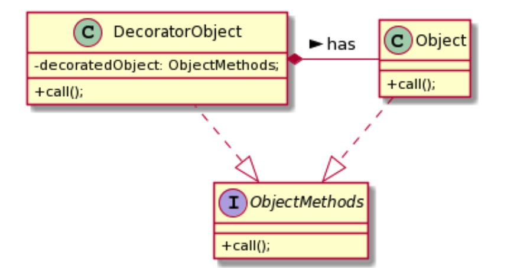

# What is Decorator pattern?

- also acts as a wrapper but only focuses on a single object.
- changing the exisiting behavior of the obejct at runtime without extending it using a subclass

&nbsp;

### UML

