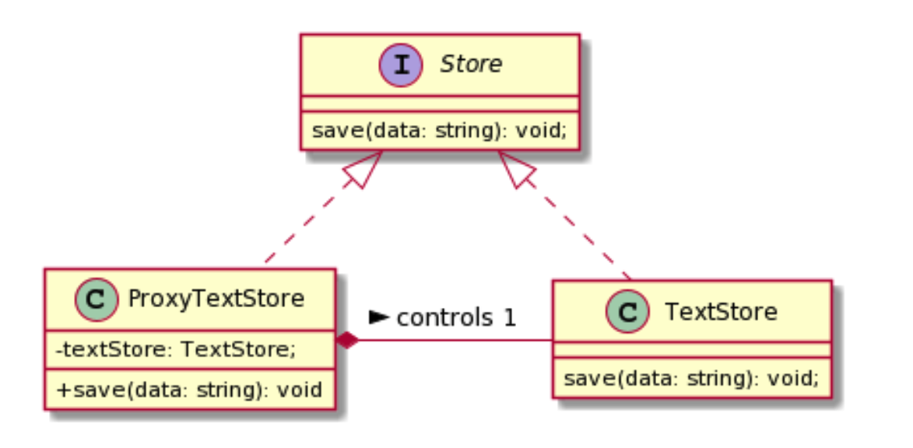

# What is Proxy pattern?

- It is an entity that wraps an object that you require delegating operations on.
- Act as a permssion gaurd and controls access to the proxied object
- One analogy of this pattern is a company secretary accepting calls on behalf of the company director

&nbsp;

### UML

- ProxyTextStore controls one instance of TextStore and it may perform delegation or lazy instantiation if neccessary.
